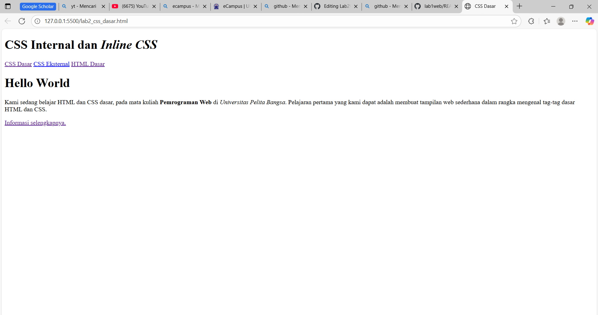
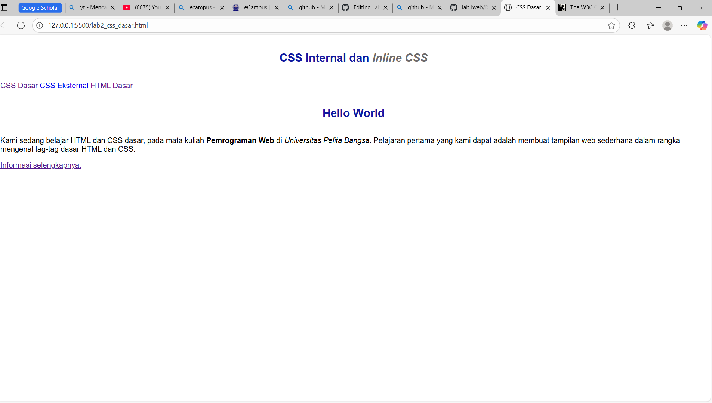
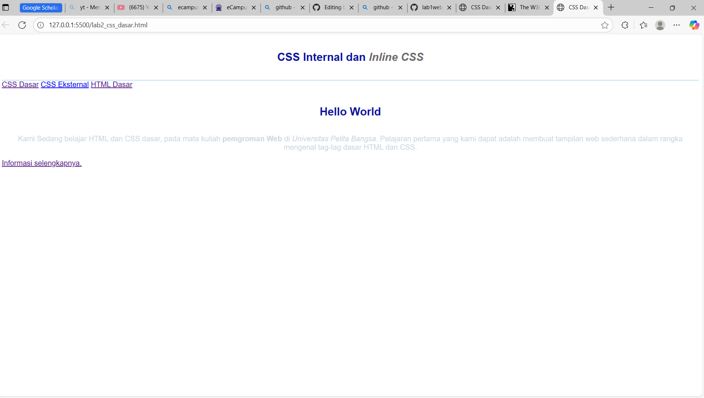
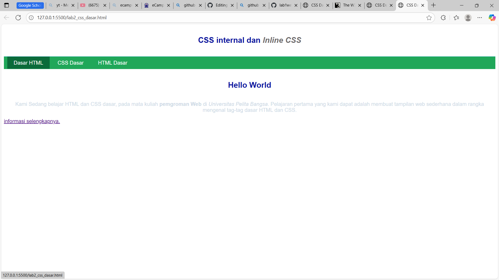
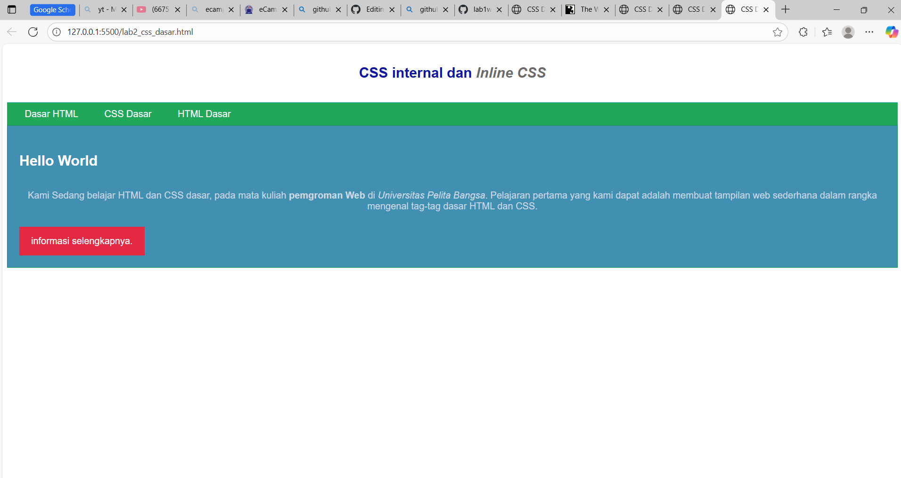
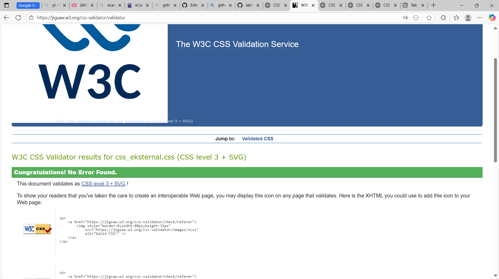
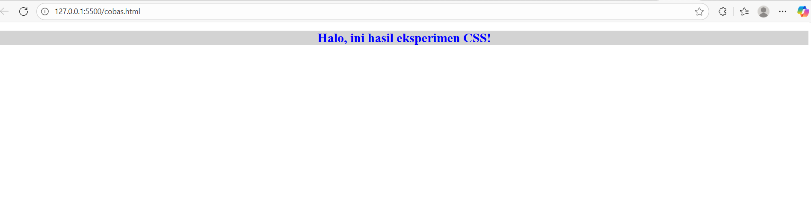
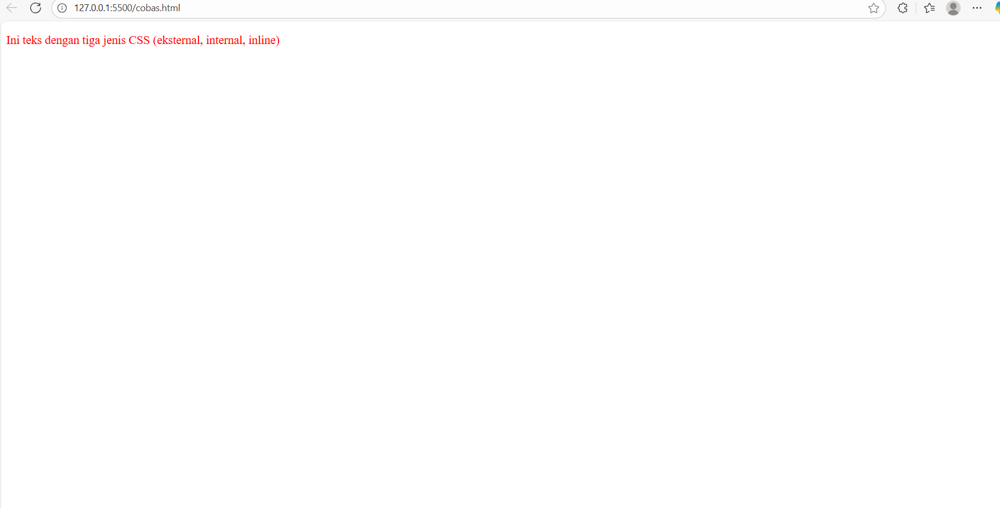
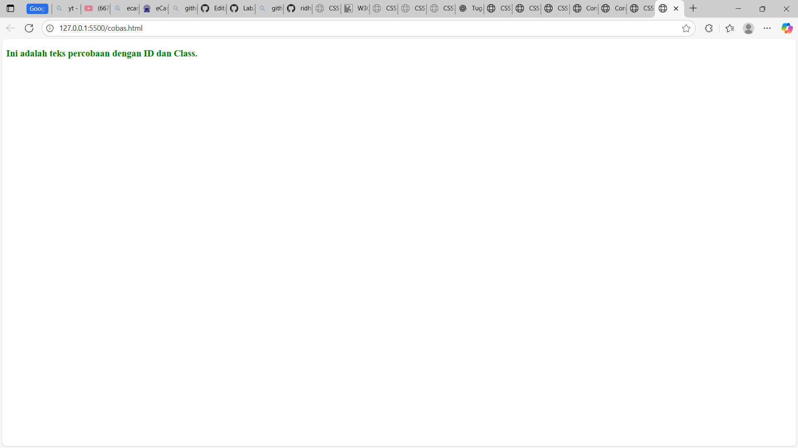

# Pratikum 2 - CSS
### NAMA : M. Ridho Febrian
### NIM : 312410500
### KELAS : TI.24.A5

## 📍LANGKAH - LANGKAH PRAKTIKUM

### 1. MEMBUAT DOKUMEN HTML

```html
<!DOCTYPE html>
<html lang="en">
<head>
    <meta charset="UTF-8">
    <meta name="viewport" content="width=device-width, initial-scale=1.0">
    <title>CSS Dasar</title>
</head>
<body>
    <header>
        <h1>CSS Internal dan <i>Inline CSS</i></h1>
</header>
    <nav>
      <a href="lab2_css_dasar.html">CSS Dasar</a>
      <a href="lab2_css_eksternal.html">CSS Eksternal</a>
      <a href="lab1_tag_dasar.html">HTML Dasar</a>
    </nav>
    <!-- CSS ID Selector -->
    <div id="intro">
          <h1>Hello World</h1>
          <p>Kami sedang belajar HTML dan CSS dasar, pada mata kuliah <b>Pemrograman
Web</b> di <i>Universitas Pelita Bangsa</i>. Pelajaran pertama yang kami dapat
adalah membuat tampilan web sederhana dalam rangka mengenal tag-tag dasar HTML
dan CSS.</p>
<!-- CSS Class Selector -->
<a class="button btn-primary" href="#intro">Informasi selengkapnya.</a>
</div>
</body>
</html>

``` 

📸 **SCREENSHOOT VSCODE DAN BROWSER/TAMPILAN**


<br>




### 2. Mendeklarasikan CSS Internal
Kemudian tambahkan deklarasi CSS internal seperti berikut pada bagian head dokumen.

```
<head>
    <title>CSS Dasar</title>
    <style>
      body {
        font-family: "Open Sans", sans-serif;
      }
      header {
        min-height: 80px;
        border-bottom: 1px solid #77ccef;
      }
      h1 {
        font-size: 24px;
        color: #0f189f;
        text-align: center;
        padding: 20px 10px;
      }
      h1 i {
        color: #6d6a6b;
      }
    </style>
</head>
```

**CONTOH TAMPILAN**




### 3. Menambahkan Inline CSS

Kemudian tambahkan deklarasi inline CSS pada tag <p> seperti berikut.
```
<p style="text-align: center; color: #ccd8e4;">
```
**CONTOH TAMPILAN**




### 4. Membuat CSS Eksternal
Buatlah file baru dengan nama style_eksternal.css kemudian buatlah deklarasi CSS seperti berikut.
```
 nav {
  background: #20a759;
  color: #fff;
  padding: 10px;
}
nav a {
  color: #fff;
  text-decoration: none;
  padding: 10px 20px;
}
nav .active,
nav a:hover {
  background: #0b6b3a;
}
```

Kemudian tambahkan tag `<link>` untuk merujuk file css yang sudah dibuat pada bagian ``<head>``
```
<link rel="stylesheet" href="css_eksternal.css" type="text/css">
```


**CONTOH TAMPILAN VSCODE DAN TAMPILAN BROWSERNYA**





### 5. Menambahkan CSS Selector

Selanjutnya menambahkan CSS Selector menggunakan ID dan Class Selector. Pada file
style_eksternal.css, tambahkan kode berikut.
```
/* ID Selector */
#intro {
  background: #418fb1;
  border: 1px solid #099249;
  min-height: 100px;
  padding: 10px;
}
#intro h1 {
  text-align: left;
  border: 0;
  color: #fff;
}
/* Class Selector */
.button {
  padding: 15px 20px;
  background: #bebcbd;
  color: #fff;
  display: inline-block;
  margin: 10px;
  text-decoration: none;
}
.btn-primary {
  background: #e42a42;
}
```

**CONTOH TAMPILAN**



### 6. validasi dokumen css dengan mengakses `https://jigsaw.w3.org/css-validator/`
**BERIKUT TAMPILANNYA**



### 7. Hasil Praktikum:


### Pertanyaan dan Tugas
  1. Lakukan eksperimen dengan mengubah dan menambah properti dan nilai pada kode CSS
dengan mengacu pada CSS Cheat Sheet yang diberikan pada file terpisah dari modul ini.
  2. Apa perbedaan pendeklarasian CSS elemen h1 {...} dengan #intro h1 {...}? berikan
penjelasannya!
  3. Apabila ada deklarasi CSS secara internal, lalu ditambahkan CSS eksternal dan inline CSS pada
elemen yang sama. Deklarasi manakah yang akan ditampilkan pada browser? Berikan
penjelasan dan contohnya!
  4. Pada sebuah elemen HTML terdapat ID dan Class, apabila masing-masing selector tersebut
terdapat deklarasi CSS, maka deklarasi manakah yang akan ditampilkan pada browser?
Berikan penjelasan dan contohnya! `(<p id="paragraf-1" class="text-paragraf"> )`

### JAWABAN:

  1. Eksperimen mengubah dan menambah properti CSS
Aku sudah coba utak-atik kode CSS dengan menambahkan beberapa properti dari cheat sheet. Misalnya, awalnya hanya ada `color: blue;`, aku tambahin `font-size: 24px;`, `background-color: lightgray;`, sama `text-align: center;`. Hasilnya, teks jadi lebih besar, warna latar belakang abu-abu muda, dan posisinya di tengah. Dari eksperimen ini jadi kelihatan kalau setiap properti CSS bisa langsung ngubah tampilan elemen HTML sesuai nilai yang dikasih.

**buat file baru**
```
<!DOCTYPE html>
<html lang="id">
<head>
  <meta charset="UTF-8">
  <title>Eksperimen CSS</title>
  <style>
    /* Awalnya hanya color: blue */
    h1 {
      color: blue;

      /* Tambahan eksperimen */
      font-size: 24px;           /* teks lebih besar */
      background-color: lightgray; /* latar abu-abu muda */
      text-align: center;        /* posisi teks di tengah */
    }
  </style>
</head>
<body>
  <h1>Halo, ini hasil eksperimen CSS!</h1>
</body>
</html>
```
**TAMPILAN NYA**



  2. Kalau nulis `h1 { ... }`, itu berarti semua elemen `<h1>` di dalam halaman akan kena styling yang sama.
Tapi kalau `#intro h1 { ... }`, styling hanya berlaku untuk elemen `<h1>`yang berada di dalam elemen dengan `id="intro"`. Jadi lebih spesifik dan terarah. Misalnya kalau ada dua `<h1>`, satu di dalam `#intro` dan satu lagi di luar, maka yang berubah cuma yang di dalam `#intro`.

  3. Kalau ada tiga jenis deklarasi CSS yang dipakai sekaligus (internal, eksternal, dan inline) untuk elemen yang sama, yang diprioritaskan browser adalah inline CSS. Soalnya inline langsung nempel di tag elemen. Urutan kekuatannya biasanya:
Eksternal < Internal < Inline.

**buat file baru html dan css nya**
```
<!DOCTYPE html>
<html lang="id">
  <head>
    <meta charset="UTF-8" />
    <title>Contoh CSS Priority</title>

    <!-- Eksternal CSS -->
    <link rel="stylesheet" href="style.css" />

    <!-- Internal CSS -->
    <style>
      p {
        color: blue; /* ini dari internal */
        font-size: 18px;
      }
    </style>
  </head>
  <body>
    <!-- Inline CSS -->
    <p style="color: red">
      Ini teks dengan tiga jenis CSS (eksternal, internal, inline)
    </p>
  </body>
</html>
```
```
p {
  color: green;   /* ini dari eksternal */
}
```

**TAMPILAN NYA**



Hasilnya: teks tampil merah karena inline lebih kuat daripada internal atau eksternal.

  4. Kalau sebuah elemen punya ID dan Class sekaligus, dan dua-duanya ada deklarasi CSS, maka yang ditampilkan adalah CSS dengan selector ID. Alasannya, ID punya tingkat spesifisitas lebih tinggi daripada Class.
**contohnya**
**buat baru file html**
```
<!DOCTYPE html>
<html lang="id">
<head>
  <meta charset="UTF-8">
  <title>Contoh ID vs Class</title>
  <style>
    /* Selector Class */
    .text-paragraf {
      color: blue;
      font-size: 18px;
    }

    /* Selector ID */
    #paragraf-1 {
      color: green;
      font-weight: bold;
    }
  </style>
</head>
<body>
  <p id="paragraf-1" class="text-paragraf">
    Ini adalah teks percobaan dengan ID dan Class.
  </p>
</body>
</html>
```
**tampilannya**



**Penjelasan**

Class `.text-paragraf` → memberi warna biru dan ukuran font 18px.

ID `#paragraf-1` → memberi warna hijau dan tebal (bold).

Karena ID lebih kuat dari Class, hasilnya teks akan muncul hijau tebal (bukan biru).


